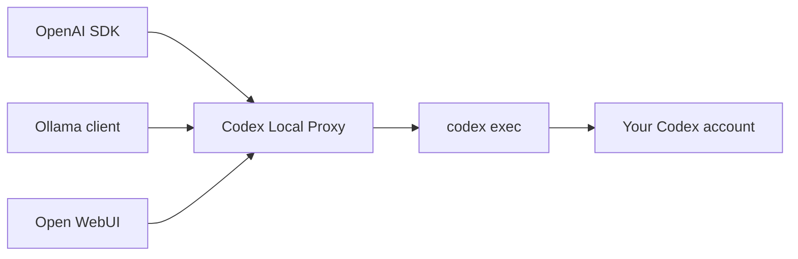

<h1 align="center">Codex Local Proxy</h1>
<p align="center">
  
</p>

<p align="center">
  <strong>Plug your Codex CLI into the tools you already love.</strong><br />
  A tiny, local-first gateway that speaks OpenAI and Ollama without hiding the Codex CLI behind a heavyweight stack.
</p>

<p align="center">
  <a href="https://github.com/djdevpro/codex-proxy/actions/workflows/ci.yml"></a>
  <a href="https://github.com/djdevpro/codex-proxy/releases"></a>
  <a href="https://bun.sh"></a>
  <a href="https://www.typescriptlang.org/"></a>
  
  
  
  
</p>

---

Codex Local Proxy turns an authenticated `codex` installation into a loopback API for OpenAI SDKs, Ollama-compatible applications, Open WebUI, automation tools, and your own scripts. It has no database, no Docker requirement, and no configuration ceremony for local use.

> [!IMPORTANT]
> This is a community bridge, not an official OpenAI API endpoint. It still follows the availability, limits, authentication, and model access of your Codex account.

## Why it feels good

| | Capability |
|---|---|
| ⚡ | One Bun process, one command, no service stack |
| 🔌 | OpenAI Chat Completions and Ollama-compatible routes |
| 🌊 | SSE streaming for OpenAI clients and NDJSON for Ollama clients |
| 🧠 | Typed model registry with `gpt-5.6-terra` and `gpt-5.6-sol` |
| 🖼️ | Local vision inputs forwarded to `codex exec --image` |
| 🎨 | Generated images exposed as local HTTP artifacts |
| 🔎 | Automatic Codex discovery on Windows, Linux, and macOS |
| 🛡️ | Loopback-only by default with a read-only Codex sandbox |
| 📦 | Standalone Windows x64 plus Linux/macOS x64 and ARM64 binaries |

## How it works



The proxy translates request and streaming formats. Codex itself remains responsible for authentication, model execution, tools, and account limits.

## Quick start

### 1. Install and authenticate Codex

macOS or Linux:

```sh
curl -fsSL https://chatgpt.com/codex/install.sh | sh
codex login
```

Windows PowerShell:

```powershell
irm https://chatgpt.com/codex/install.ps1 | iex
codex login
```

The proxy checks your `PATH`, `CODEX_INSTALL_DIR`, and the official default install locations automatically. Codex Desktop is also detected on Windows.

### 2. Run the proxy

```sh
bun install
bun run start
```

```text
Codex Local Proxy v1.0.0
Ready on http://127.0.0.1:8787
OpenAI: http://127.0.0.1:8787/v1
Ollama: http://127.0.0.1:8787
```

No proxy token is needed while it stays on the default loopback address.

### 3. Send a request

Ollama-compatible chat:

```sh
curl http://127.0.0.1:8787/api/chat \
  -H "Content-Type: application/json" \
  -d '{
    "model": "gpt-5.6-terra",
    "messages": [{"role": "user", "content": "Say hello in French"}],
    "stream": false
  }'
```

OpenAI SDK:

```ts
import OpenAI from "openai";

const client = new OpenAI({
  baseURL: "http://127.0.0.1:8787/v1",
  apiKey: "local", // Required by the SDK; ignored by the local proxy.
});

const completion = await client.chat.completions.create({
  model: "gpt-5.6-terra",
  messages: [{ role: "user", content: "Give me three names for a CLI tool." }],
});

console.log(completion.choices[0]?.message.content);
```

## Ollama-compatible clients

Use this connection:

| Setting | Value |
|---|---|
| Base URL | `http://127.0.0.1:8787` |
| Model | `gpt-5.6-terra` |

Clients running inside Docker may not be able to reach a host service bound to loopback. If you deliberately bind the proxy to another interface, protect it with `CODEX_PROXY_TOKEN`; never expose an authenticated Codex session directly to the public internet.

## API surface

| Method | Route | Compatibility |
|---|---|---|
| `GET` | `/health` | Health and version |
| `GET` | `/v1/models` | OpenAI model list |
| `GET` | `/v1/models/:id` | OpenAI model details |
| `POST` | `/v1/chat/completions` | OpenAI chat, including SSE |
| `POST` | `/v1/images/generations` | OpenAI image generation, including `n` images |
| `GET` | `/api/tags` | Ollama model list |
| `GET` | `/api/ps` | Ollama process list |
| `GET` | `/api/version` | Ollama-style version |
| `POST` | `/api/show` | Ollama model metadata |
| `POST` | `/api/chat` | Ollama chat, including NDJSON |
| `POST` | `/api/generate` | Ollama generation, including NDJSON |
| `GET` | `/artifacts/:id/:filename` | Generated image download |

OpenAI `developer` and legacy `system` messages are forwarded as one per-request Codex `developer_instructions` value. This keeps their priority instead of flattening them into the user prompt, but it also means their original position is not preserved: a sliding instruction inserted during a later turn is promoted to the top for the whole proxied execution. Keep instruction messages at the beginning of the request, or start a fresh request when changing them mid-conversation.

## Local image input

Pass a local `file://` URL in an OpenAI content part. The proxy converts it into a Codex `--image` argument:

```json
{
  "model": "gpt-5.6-terra",
  "messages": [{
    "role": "user",
    "content": [
      {"type": "text", "text": "Describe this image."},
      {"type": "image_url", "image_url": {"url": "file:///absolute/path/image.png"}}
    ]
  }]
}
```

## Generated image output

For OpenAI-compatible applications, use the Images API route. It follows the conventional `{ created, data: [...] }` response and supports `n` from 1 to 10. Each `data` entry contains one `b64_json` image by default:

```sh
response=$(curl -s http://127.0.0.1:8787/v1/images/generations \
  -H "Content-Type: application/json" \
  -d '{
    "model": "gpt-image-2",
    "prompt": "Two cheerful illustrations containing the word Bonjour.",
    "n": 2,
    "size": "1024x1024",
    "quality": "high"
  }')

echo "$response" | jq
echo "$response" | jq -r '.data[0].b64_json' | base64 --decode > bonjour-1.png
echo "$response" | jq -r '.data[1].b64_json' | base64 --decode > bonjour-2.png
```

For local URL output, request `"response_format": "url"`; each item in `data` then contains a temporary proxy URL. This legacy-compatible convenience is useful with `curl`, while GPT Image-style base64 remains the default.

Generated images are kept by Codex under `~/.codex/generated_images/`. The proxy discovers every image belonging to the current Codex thread, so multiple tool calls and multiple files are preserved. It also includes local metadata in the namespaced `x_codex_artifacts` extension:

```json
{
  "created": 1713833628,
  "data": [
    {"b64_json": "..."},
    {"b64_json": "..."}
  ],
  "x_codex_artifacts": [{
    "id": "...",
    "type": "image",
    "filename": "generated.png",
    "mime_type": "image/png",
    "url": "http://127.0.0.1:8787/artifacts/.../generated.png"
  }]
}
```

You can still ask for image generation through `/api/chat` or `/v1/chat/completions`. Those text APIs receive Markdown image links plus an `artifacts` extension because Chat Completions has no standard generated-image output shape.

`gpt-image-*` names on this route are compatibility aliases: generation is performed by the authenticated Codex agent through its available `imagegen` skill, not by a direct OpenAI Images API key. `n`, `size`, `quality`, and background constraints are injected as per-request Codex developer instructions while the creative prompt stays untouched. `size` and `quality` are therefore best effort rather than native tool guarantees. PNG output is supported; native transparency and partial-image streaming are not. Artifact URLs are unguessable local capability URLs and remain registered until the proxy restarts.

## Configuration

Everything is optional for local use.

| Variable | Default | Purpose |
|---|---|---|
| `CODEX_PROXY_HOST` | `127.0.0.1` | Listen address |
| `CODEX_PROXY_PORT` | `8787` | Listen port |
| `CODEX_PROXY_MODEL` | `gpt-5.6-terra` | Default model |
| `CODEX_PROXY_COMMAND` | auto-detected | Absolute path or command name for Codex |
| `CODEX_PROXY_SANDBOX` | `read-only` | Codex sandbox mode |
| `CODEX_PROXY_TIMEOUT_MS` | `600000` | Request timeout |
| `CODEX_PROXY_TOKEN` | unset | Optional Bearer token; required outside loopback |

Example with a different port:

```sh
CODEX_PROXY_PORT=9090 bun run start
```

## Quality checks

```sh
bun run test:unit         # fast in-process tests
bun run test:integration  # real server process + executable dummy Codex CLI
bun run check             # strict TypeScript + both deterministic test suites
bun run smoke             # optional end-to-end request through your authenticated Codex CLI
bun run build             # binary for the current OS and architecture
bun run build:linux
bun run build:macos
bun run build:windows
```

## Releases

The repository includes two workflows:

- **CI** runs unit tests and a black-box integration suite with a dummy Codex executable, then compiles Linux x64, runs the binary, and keeps it as a workflow artifact. GitHub never needs Codex credentials.
- **Release** builds Windows x64 plus Linux and macOS binaries for x64 and ARM64, packages them, generates SHA-256 checksums, and attaches everything to a GitHub Release.

Publish from the command line:

```sh
git tag v1.0.0
git push origin v1.0.0
```

Or open **Actions → Release → Run workflow** on GitHub and provide an existing version tag. If the release already exists, its assets are updated; otherwise the workflow creates it with generated release notes.

Standalone binaries include the Bun runtime, but they do **not** bundle Codex or your credentials. The target machine still needs an authenticated Codex CLI installation.

Browse published builds on the [GitHub Releases page](https://github.com/djdevpro/codex-proxy/releases).

## Current boundaries

- Chat Completions and Ollama chat/generate are supported; the Responses API is not yet emulated.
- Tool-call JSON is not translated into OpenAI function-calling responses.
- Each request starts an ephemeral `codex exec` turn; conversation state belongs to the calling client.
- Token usage is returned as zero because the plain CLI output does not expose reliable usage counts.
- Model availability ultimately depends on the authenticated Codex account.

## Development

```sh
bun install
bun run dev
bun run test:watch
```

The active application lives in `src/`. Unit tests live directly in `test/`; the black-box suite and its deterministic dummy CLI live in `test/integration/` and `test/fixtures/`. Release tooling lives in `scripts/` plus `.github/workflows/`.

---

<p align="center">
  Built for local workflows that deserve first-class APIs.<br />
  <sub>Keep it on loopback. Keep it simple. Let Codex do the hard part.</sub>
</p>
