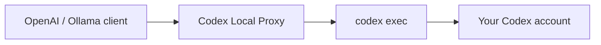

<h1 align="center">Codex Local Proxy</h1>

<p align="center">
  
</p>

<p align="center">
  <strong>Plug your Codex CLI into the tools you already love.</strong><br />
  A small, local-first gateway that speaks OpenAI and Ollama.
</p>

<p align="center">
  <a href="https://github.com/djdevpro/codex-proxy/actions/workflows/ci.yml"></a>
  <a href="https://github.com/djdevpro/codex-proxy/releases"></a>
  <a href="https://bun.sh"></a>
  
  
  
</p>

---

Codex Local Proxy turns an authenticated `codex` installation into a loopback API for OpenAI SDKs, Ollama-compatible apps, Open WebUI, automations, and scripts. No database, Docker, API key, or proxy token is required for local use.

> [!IMPORTANT]
> This is a community bridge, not an official OpenAI endpoint. Availability, limits, authentication, and model access still come from your Codex account.

## Highlights

| | Capability |
|---|---|
| ⚡ | One Bun process and one command |
| 🔌 | OpenAI Chat Completions and Ollama-compatible routes |
| 🌊 | SSE and NDJSON streaming |
| 🖼️ | Local vision input and generated image output |
| 🔎 | Automatic Codex discovery on Windows, Linux, and macOS |
| 🛡️ | Loopback-only and read-only sandbox defaults |
| 📦 | Standalone Windows x64, Linux/macOS x64 and ARM64 binaries |



The proxy translates request and response formats. Codex remains responsible for authentication, model execution, tools, and account limits.

## Quick start

### 1. Install and authenticate Codex

macOS or Linux:

```sh
curl -fsSL https://chatgpt.com/codex/install.sh | sh
codex login
```

Windows PowerShell:

```powershell
irm https://chatgpt.com/codex/install.ps1 | iex
codex login
```

### 2. Start the proxy

```sh
bun install
bun run start
```

The service is ready at `http://127.0.0.1:8787`. You can alternatively run a standalone binary from [GitHub Releases](https://github.com/djdevpro/codex-proxy/releases). Codex is discovered from `PATH`, `CODEX_INSTALL_DIR`, official install locations, and Codex Desktop on Windows.

### 3. Connect a client

OpenAI SDK:

```ts
import OpenAI from "openai";

const client = new OpenAI({
  baseURL: "http://127.0.0.1:8787/v1",
  apiKey: "local", // Required by the SDK, ignored by the proxy.
});

const result = await client.chat.completions.create({
  model: "gpt-5.6-terra",
  messages: [{ role: "user", content: "Say hello in French." }],
});

console.log(result.choices[0]?.message.content);
```

Ollama-compatible chat:

```sh
curl http://127.0.0.1:8787/api/chat \
  -H "Content-Type: application/json" \
  -d '{"model":"gpt-5.6-terra","messages":[{"role":"user","content":"Say hello in French."}],"stream":false}'
```

| Client setting | Value |
|---|---|
| OpenAI base URL | `http://127.0.0.1:8787/v1` |
| Ollama base URL | `http://127.0.0.1:8787` |
| Default model | `gpt-5.6-terra` |

Docker clients cannot usually reach a host service bound to loopback. If you deliberately bind another interface, set `CODEX_PROXY_TOKEN` and never expose an authenticated Codex session directly to the internet.

## API

| Method | Route | Purpose |
|---|---|---|
| `GET` | `/health` | Health and version |
| `GET` | `/v1/models` | OpenAI model catalog |
| `POST` | `/v1/chat/completions` | OpenAI chat and SSE |
| `POST` | `/v1/images/generations` | OpenAI-style image generation |
| `GET` | `/api/tags` | Ollama model catalog |
| `POST` | `/api/chat` | Ollama chat and NDJSON |
| `POST` | `/api/generate` | Ollama generation and NDJSON |
| `GET` | `/artifacts/:id/:filename` | Generated image download |

Metadata helpers such as `/v1/models/:id`, `/api/ps`, `/api/version`, and `/api/show` are also available.

The first message is promoted to Codex `developer_instructions` only when its role is `developer` or legacy `system`. Any later instruction message stays in its original position in the conversational prompt, so sliding changes are not moved back to the top.

## Images

### Local image input

Use a local `file://` URL in an OpenAI content part. The proxy forwards it to `codex exec --image`:

```json
{
  "model": "gpt-5.6-terra",
  "messages": [{
    "role": "user",
    "content": [
      {"type": "text", "text": "Describe this image."},
      {"type": "image_url", "image_url": {"url": "file:///absolute/path/image.png"}}
    ]
  }]
}
```

### Generated images

```sh
curl http://127.0.0.1:8787/v1/images/generations \
  -H "Content-Type: application/json" \
  -d '{
    "model":"gpt-image-2",
    "prompt":"Two cheerful illustrations containing the word Bonjour.",
    "n":2,
    "size":"1024x1024",
    "quality":"high",
    "response_format":"url"
  }'
```

- `n` accepts 1–10 images.
- The default response uses `{ created, data: [{ b64_json }] }`; `response_format: "url"` returns temporary local URLs.
- Every result is also described in the `x_codex_artifacts` extension and saved by Codex under `~/.codex/generated_images/`.
- `gpt-image-*` is a compatibility alias: the authenticated Codex agent invokes its `imagegen` skill. `size` and `quality` are developer-instruction targets, so they are best effort.
- PNG is supported. Native transparency and partial-image streaming are not.

Image requests made through chat still receive Markdown image links plus an `artifacts` extension.

## Configuration

All settings are optional on loopback.

| Variable | Default | Purpose |
|---|---|---|
| `CODEX_PROXY_HOST` | `127.0.0.1` | Listen address |
| `CODEX_PROXY_PORT` | `8787` | Listen port |
| `CODEX_PROXY_MODEL` | `gpt-5.6-terra` | Default model |
| `CODEX_PROXY_COMMAND` | auto-detected | Codex executable |
| `CODEX_PROXY_SANDBOX` | `read-only` | Codex sandbox mode |
| `CODEX_PROXY_TIMEOUT_MS` | `600000` | Request timeout |
| `CODEX_PROXY_TOKEN` | unset | Optional on loopback; required elsewhere |

## Development and validation

```sh
bun run dev               # development server
bun run test:unit         # fast in-process tests
bun run test:integration  # real server + executable dummy Codex CLI
bun run check             # typecheck + every deterministic test
bun run smoke             # optional test through your authenticated Codex CLI
bun run build             # binary for the current platform
bun run build:release     # all five release targets
```

## Releases

- **CI** runs typechecking, unit tests, black-box integration tests with a dummy Codex CLI, and a Linux binary smoke test. GitHub needs no Codex credentials.
- **Release** packages Windows x64 plus Linux/macOS x64 and ARM64 binaries with SHA-256 checksums.

```sh
git tag v1.0.0
git push origin v1.0.0
```

You can also run the Release workflow manually for an existing tag. Standalone binaries include Bun, but not Codex or credentials; the target machine still needs an authenticated Codex CLI. See [GitHub Releases](https://github.com/djdevpro/codex-proxy/releases).

## Boundaries

- The Responses API and OpenAI function-call translation are not implemented.
- Each request starts an ephemeral `codex exec`; conversation state belongs to the client.
- Usage tokens are reported as zero because the CLI does not expose reliable counts here.
- Model availability depends on the authenticated Codex account.

---

<p align="center">
  Built for local workflows that deserve first-class APIs.<br />
  <sub>Keep it on loopback. Keep it simple. Let Codex do the hard part.</sub>
</p>
